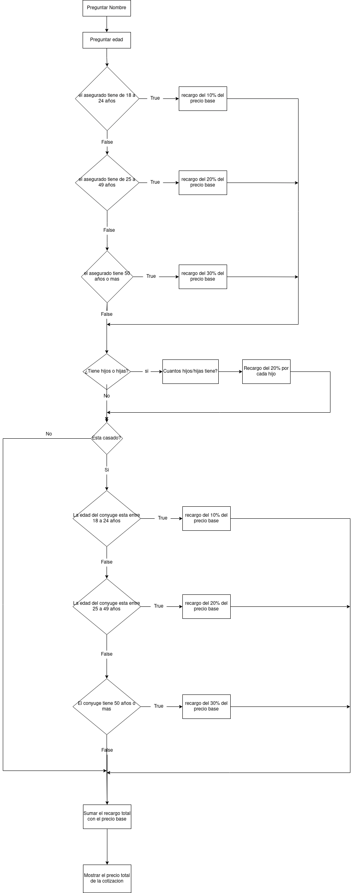

# Unidad 4 - PROYECTO FINAL

Proyecto final de la unidad 4. Este es un programa escrito en JavaScript que
calcula cotizaciones, el valor final de la cotizacion es un precio base que se
le suma varios recargos basados en la edad del asegurado, la edad del conyuge,
y numero de hijos.

### Posibles Mejoras
Una interfaz grafica, para que sea mas intuitivo para el usuario del programa
ingresar la informacion del asegurado.

### Diagrama de flujo

