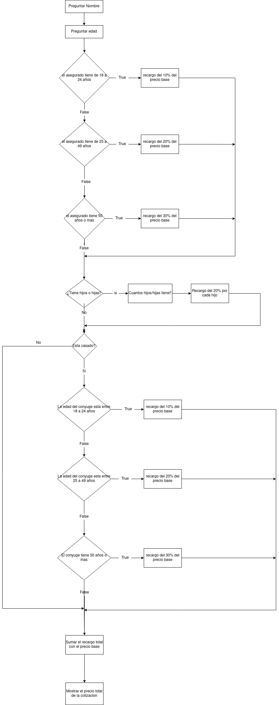

# Algoritmo del Procedimiento

1. Preguntar el nombre del asegurado

2. Preguntar la edad del asegurado
3. Si el asegurado tiene de 18 a 24 años, hacer un recargo del 10% del precio base.
4. Si el asegurado tiene de 25 a 49 años, hacer un recargo del 20% del precio base.
5. Si el asegurado tiene 50 años o mas, hacer un recargo del 30% del precio base.

6. Preguntar si el asegurado tiene hijos
7. Si el asegurado tiene hijos, preguntar cuantos hijos tiene.
8. Hacer un recargo del 20% del precio base por cada hijo del asegurado.

9. Preguntar si el asegurado esta casado.
10. si el asegurado esta casado hacer el siguiente recargo:
  * recargo del 10% del precio base, si el conyuge tiene de 18 a 24 años.
  * recargo del 20% del precio base, si el conyuge tiene de 25 a 49 años.
  * recargo del 30% del precio base, si el conyuge tiene 50 años o mas.

11. Precio total de la cotización = Recargo total + Precio Base
12. Mostrar el precio total de la cotización en pantalla.

### Diagrama de Flujo

